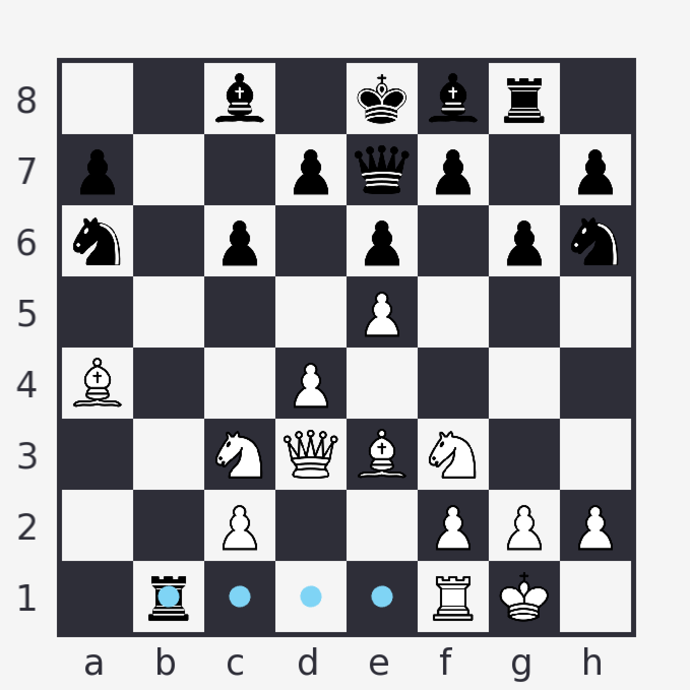

# Chess Engine

## Overview

This project implements a chess engine in C++ and offers a GUI to allow the user to play against the engine.

## Features

- **Chess Engine:** The core of the project is a powerful chess engine that implements various algorithms and strategies for playing chess.

- **Graphical User Interface:** Features a GUI, eliminating the need to play through a command-line interface.

- **Legal Move Generation:** Generates and displays all legal moves in a given position, and ensures all player moves are legal. Accounts for special moves such as castling, promotions, and en passant.

- **Checkmate and Stalemate Detection:** Detects a win or draw when one side runs out of legal moves.

    

## How to Use

1. **Installation**: Clone the repository to your local machine.
2. **Dependencies**: Ensure you have [SFML](https://www.sfml-dev.org/download.php) installed on your machine. This library is used to create the GUI.
3. **Adjust Screen Size**: Before running the GUI, you can adjust the screen size by modifying the `WINDOW_SIZE` variable in `gui.cpp`.
4. **Running the GUI**: You can launch the GUI by running the `make run` command from the root directory.
5. **Running the Perft Test**: To run the Perft test, use the command `make perft DEPTH={depth}` where `{depth}` is the desired depth. For example, `make perft DEPTH=5` will run the Perft test to a depth of 5.

## License

This project is licensed under the [MIT License](LICENSE).
